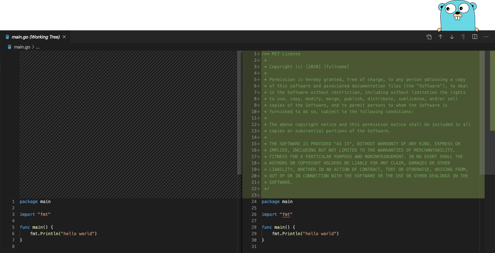

 

Multiplatform command line tool that **checks** whether the **license headers** are included in the **source files** of a project.

- It can **insert the license** to a file in case it does not exist (optional).
- It can **replace the license** of a file in case it is different than the target (optional).
- It is possible to **choose the file extensions that will be processed**.
- Specific **folders, files and paths can be ignored**.

_DISCLAIMER_

The tool expects the software license to be in a **block comment at the beginning of the file** following the format `/* */`.

Thus, while it does support the source files of languages like _Go, Rust, JavaScript, TypeScript, C, C++, Java, Swift, Kotlin and C#_, it does not support the file extensions that do not use this style.

# Command Usage

## Syntax

```bash
$ license-header-checker [-a] [-r] [-v] [-i path1,...] license-header-path src-path extensions...
```

## Options

```
  -a        Add the target license in case the file does not have any.
  -r        Replace the existing license by the target one in case they are different.
  -v        Be verbose during execution.
  -i        A comma separated list of the folders, files and/or paths that should be ignored.
            It does not support wildcards.
  -version  Display version number.
```

## Example

```bash
$ license-header-checker -v -a -r -i node_modules,client/assets ../license_header.txt . js ts
```

# Using in CI

## GitHub Action example

```yml
name: license-check
on: [push]
jobs:
  build:
    runs-on: ubuntu-latest
    steps:
      - name: Check out code
        uses: actions/checkout@v3
      - name: Set up Go
        uses: actions/setup-go@v3
        with:
          go-version: "1.18.3"
      - name: Install license-header-checker
        run: ./install.sh
      - name: Run license check
        run: license-header-checker -a -r ./license_header.txt . go && [[ -z `git status -s` ]]
```

# Installation

## Install script

For linux and MacOS systems you can use the install script:

```bash
$ curl -s https://raw.githubusercontent.com/lluissm/license-header-checker/master/install.sh | bash
```

## Binary packages

The binary packages for Linux, Windows and macOS are uploaded for each release and can be downloaded from the [releases](https://github.com/lluissm/license-header-checker/releases) page.

## Installing from source

Provided you have Go and make installed, just type:

```bash
$ make install
```
